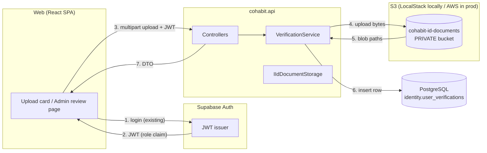
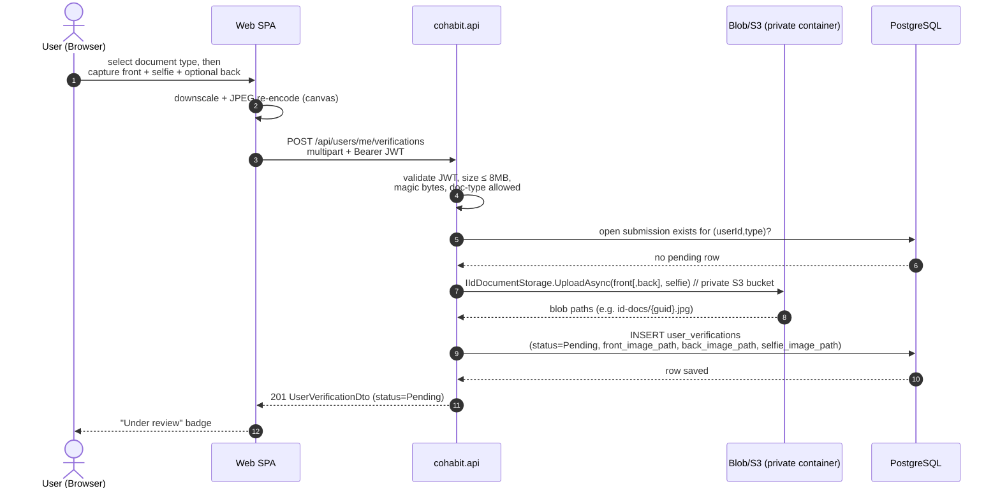
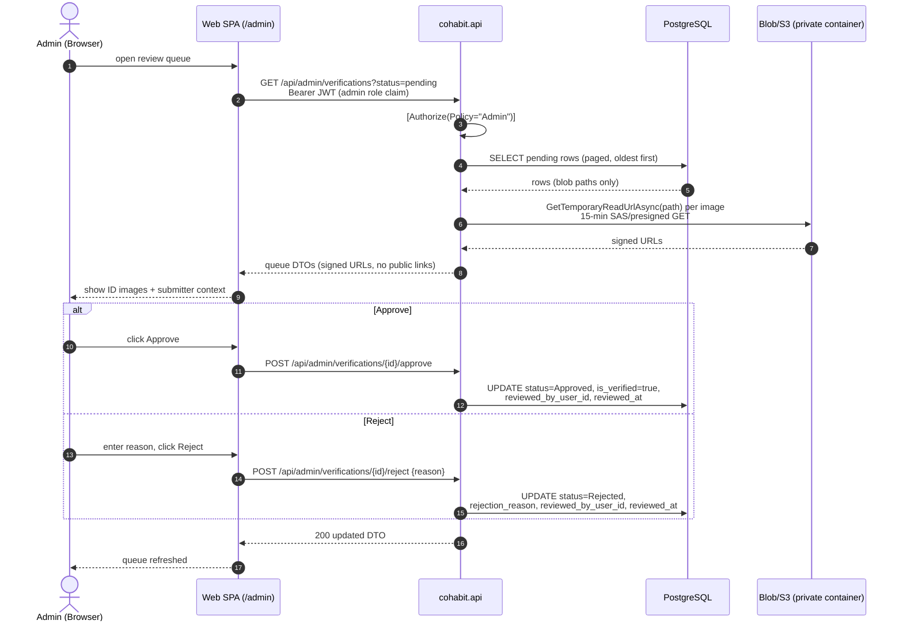
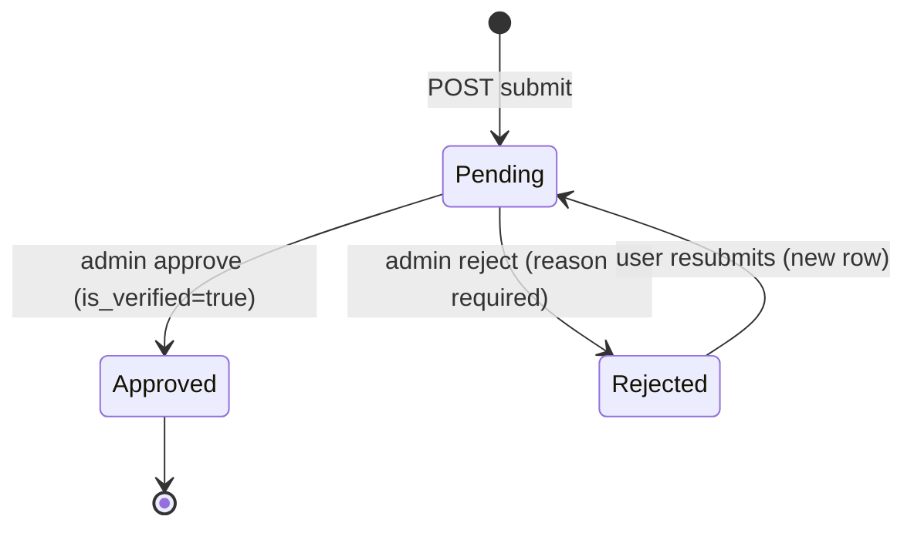

# ID Picture Verification — Design

Manual (admin-reviewed) identity verification: users upload photos of their ID
documents, images go to blob storage, an administrator approves or rejects each
submission.

## Goals

- Users can submit ID pictures for a chosen document type (Identity Document,
  Passport, Driver's License).
- Admins can review a queue, view submitted images, approve or reject with a reason.
- Images are **private** — never publicly readable; served only to reviewers via
  short-lived signed URLs.
- Full attempt history retained (rejections don't destroy prior submissions).
- Fits existing patterns: Controller → Service → Accessor, sealed domain entities,
  snake_case EF mapping, auto-applied migrations.

## Non-goals (for now)

- Automated document OCR / face-match (can be added later as a pre-filter stage).
- Selfie-to-ID biometric match.
- Admin UI beyond a minimal review page (design covers API + basic web flow).

---

## 1. Storage

**Decision:** two object stores run side by side — this is fixed by product
requirement, not a config switch:

| Content | Store | Visibility | URL in DB |
|---|---|---|---|
| Listing images (`IImageStorage` → `BlobImageStorage`) | **Azure Blob** (Azurite locally) | public container | absolute public URL |
| ID verification images (`IIdDocumentStorage` → `S3ImageStorage`) | **S3** (LocalStack locally via Aspire AppHost; AWS in prod) | **private bucket** `cohabit-id-documents` | object path only, resolved to presigned URL on read |

### Interfaces

```csharp
public interface IImageStorage                       // Azure Blob, listing photos
{
    Task<string> UploadAsync(string fileName, byte[] content, string contentType, CancellationToken ct = default);
}

public interface IIdDocumentStorage                  // S3, ID verification docs
{
    Task<string> UploadAsync(...);                   // returns object path, never a public URL
    Task<string> GetTemporaryReadUrlAsync(string path, TimeSpan? lifetime = null, CancellationToken ct = default);
}
```

- Both registered unconditionally in DI; services inject exactly the store they
  need. The future VerificationService depends only on `IIdDocumentStorage`.
- Local wiring: AppHost runs a LocalStack container + Azurite side by side and
  injects `S3__*` env vars into `cohabit-api`; buckets are created at API startup
  (`EnsureBucketAsync`). For prod AWS, set the same `S3:*` config values with
  empty `ServiceUrl` and normal IAM credentials.
- Magic-byte sniffing lives in shared `ImageFormatDetector`; reject anything that
  isn't png/jpg/webp/jpeg. Enforce max size (e.g. 8 MB) at controller level.

---

## 2. Data Model

Reuse the existing KYC scaffolding — `identity.user_verifications` and the seeded
`verification_types` lookup (`IdentityDocument`, `Passport`, `DriversLicense`,
…) already exist. Each submission becomes one row (an attempt), giving free
history.

### Extended `UserVerification`

```csharp
public sealed class UserVerification
{
    public Guid Id { get; private set; }
    public Guid UserId { get; private set; }
    public int VerificationTypeId { get; private set; }
    public bool IsVerified { get; private set; }          // kept: denormalized outcome, consumed by ListingDetailDto owner verifications
    public DateTime Timestamp { get; private set; }       // submission time

    // --- new ---
    public VerificationStatus Status { get; private set; }        // Pending | Approved | Rejected
    public string? FrontImagePath { get; private set; }           // private blob path
    public string? BackImagePath { get; private set; }            // optional (e.g. ID card rear)
    public string? SelfieImagePath { get; private set; }          // required: selfie for face-match verification
    public Guid? ReviewedByUserId { get; private set; }           // admin who decided
    public DateTime? ReviewedAt { get; private set; }
    public string? RejectionReason { get; private set; }

    public void Approve(Guid reviewerId);
    public void Reject(Guid reviewerId, string reason);   // sets IsVerified=false, Status=Rejected
}
```

### New enum

```csharp
public enum VerificationStatus { Pending = 0, Approved = 1, Rejected = 2 }
```
Stored as `smallint` (matches the lookup-int convention; no lookup table needed —
statuses are fixed by code, not data).

### Mapping (`CohabitDbContext.OnModelCreating`, schema `identity`)

```csharp
entity.Property(uv => uv.Status).HasColumnName("status").IsRequired();
entity.Property(uv => uv.FrontImagePath).HasColumnName("front_image_path");
entity.Property(uv => uv.BackImagePath).HasColumnName("back_image_path");
entity.Property(uv => uv.SelfieImagePath).HasColumnName("selfie_image_path");
entity.Property(uv => uv.ReviewedByUserId).HasColumnName("reviewed_by_user_id");
entity.Property(uv => uv.ReviewedAt).HasColumnName("reviewed_at");
entity.Property(uv => uv.RejectionReason).HasColumnName("rejection_reason");
```

### Migration & indexes

EF migration `AddIdPictureVerification`:

- New nullable columns above (existing rows keep `IsVerified` semantics;
  backfill `status = case when is_verified then 1 else 2 end`… or leave NULL-as-Pending
  only for rows with documents — simplest: backfill approved rows to `Approved`,
  legacy rows without documents are ignored by the review queue via
  `WHERE front_image_path IS NOT NULL`). Selfie added via `AddVerificationSelfie`
  migration (`selfie_image_path` nullable column).
- Partial unique index: **one open submission per user+type**
  `CREATE UNIQUE INDEX ... ON identity.user_verifications (user_id, verification_type_id)
   WHERE status = 0` — enforced defensively in the service too.

### Why not a separate table?

`user_verifications` was built exactly for this and is already surfaced in
listing DTOs. Adding review columns avoids a second entity/join and keeps
"owner verifications" logic unchanged.

---

## 3. Admin Authorization (greenfield RBAC)

No roles exist anywhere today. Minimal viable approach, aligned with Supabase Auth:

- Role lives in the Supabase JWT under `app_metadata.role` (set via Supabase
  Dashboard / admin API — **not** client-editable).
- In `ServiceExtensions.AddJwtBearer`, add a claims transformation that maps
  `app_metadata.role` → standard `ClaimTypes.Role`.
- Policy:

```csharp
builder.Services.AddAuthorization(o =>
    o.AddPolicy("Admin", p => p.RequireRole("admin")));
```

- Controllers use `[Authorize(Policy = "Admin")]`. Dev convenience: config list
  of admin user IDs (`Admin:UserIds`) OR-ed into the policy for local testing.

---

## 4. API Design

All authenticated via bearer JWT. Errors follow existing typed exceptions +
`ApiExceptionFilter` (ProblemDetails).

### User endpoints

| Method | Route | Description |
|---|---|---|
| POST | `/api/users/me/verifications` | Submit: multipart form `type` (identity_document \| passport \| drivers_license), `frontImage` (required), `selfieImage` (required), `backImage` (optional). Returns `201` + `UserVerificationDto`. |
| GET | `/api/users/me/verifications` | Caller's own submissions incl. status + rejection reason. Signed image URLs included, short-lived. |

Rules enforced in `IVerificationService.SubmitAsync`:

- Type must be a document type (reject email/phone/proof_of_address types here).
- Max size 8 MB, image/* only (magic bytes), 2–3 images (front + selfie required, back optional).
- ConflictException (`verification_pending`) if an open submission exists for that type.

### Image acquisition — file upload **or** device camera

The API contract is identical for both sources: whatever the client captured is
sent as standard multipart image bytes. Capture is a **client-side concern**;
the backend only sees a validated image blob.

Web UX (`DocumentCapture` component, used per side front/back/selfie):

| Mode | Mechanism | Notes |
|---|---|---|
| **Upload** | `<input type="file" accept="image/png,image/jpeg,image/webp">` + drag-drop zone | Existing listing-upload pattern. |
| **Camera** | `<input type="file" accept="image/*" capture="environment">` | On phones this opens the rear camera natively — zero extra code, works in all mobile browsers. |
| **Camera (selfie)** | `<input type="file" accept="image/*" capture="user">` | On phones this opens the front camera natively for selfie capture. |
| **Camera (desktop)** | `navigator.mediaDevices.getUserMedia({ video: { facingMode } })` → `<video>` preview → grab frame to `<canvas>` → `canvas.toBlob(...)` | Shown when `getUserMedia` is available and no `capture` attribute path was taken; `facingMode` is `"environment"` for documents, `"user"` for selfie. Fallback to upload input on permission denial / unsupported browsers. |

Client-side processing before upload (both modes):

- Downscale longest edge to ~2000px via canvas (camera frames are huge; keeps
  payloads under the 8 MB cap and review loads fast).
- Re-encode to JPEG quality ~0.85 → produces one consistent `image/jpeg` blob.
- Strip EXIF orientation by drawing through canvas (prevents sideways IDs);
  this also removes GPS EXIF data from phone photos before it ever leaves the
  device.
- Resulting `Blob` is appended to the same `FormData` regardless of source.

Permissions: request camera only on explicit user action ("Take photo" button);
handle `NotAllowedError` with a message pointing back to file upload.

Response DTO:

```csharp
public record UserVerificationDto(
    Guid Id, string Type, string Status,
    string? FrontImageUrl, string? BackImageUrl, string? SelfieImageUrl,  // temporary signed URLs
    DateTime SubmittedAt, DateTime? ReviewedAt, string? RejectionReason);
```

### Admin endpoints (`[Authorize(Policy = "Admin")]`, route `api/admin/verifications`)

| Method | Route | Description |
|---|---|---|
| GET | `?status=pending&type=&page=` | Review queue, oldest first, paged. |
| GET | `/{id:guid}` | Single submission + signed URLs (admin sees any, regardless of ownership). |
| POST | `/{id:guid}/approve` | Body: none. Idempotent guard: must be Pending else ConflictException. |
| POST | `/{id:guid}/reject` | Body: `{ "reason": "..." }` (required, max 500 chars). |

On approve: `Approve(reviewerId)` sets `Status=Approved`, `IsVerified=true`,
`ReviewedByUserId`, `ReviewedAt`. On reject: analogous with required reason.

---

## 5. Flows

### Component overview



### Submission (user uploads ID)



### Review (admin approves/rejects)



### Status lifecycle



Optional follow-up (out of scope v1): notify user via comms.api (Resend email)
on decision.

---

## 6. Security & Privacy

- Private container; DB stores paths, never durable public URLs. Signed URLs:
  15 min TTL, read-only, generated only for owner-of-record or admins.
- Never log blob paths together with user identifiers beyond what's needed.
- Input hardening: content-length cap, magic-byte sniffing (already implemented),
  GUID blob names (no user-controlled filenames).
- Least exposure in listings: `ListingDetailDto` owner-verifications continues to
  expose booleans only — never document images.
- Audit: `reviewed_by_user_id` + `reviewed_at` give an immutable-enough trail;
  consider a lightweight `audit_log` later if multiple admins arrive.
- Retention: rejected docs retained for history/dispute; add purge job later if
  compliance requires (e.g. delete after N days post-decision).

---

## 7. Implementation Checklist (repo-pattern order)

Application (`src/cohabit.application`):
1. `Domain/VerificationStatus.cs` enum.
2. Extend `Domain/UserVerification.cs` (+ `Approve`/`Reject` methods).
3. Map new columns in `Data/CohabitDbContext.cs`.
4. `dotnet ef migrations add AddIdPictureVerification -p src/cohabit.application -s src/cohabit.api`.

API (`src/cohabit.api`):
5. Done: `IIdDocumentStorage` + `S3ImageStorage` (private bucket,
   presigned reads); LocalStack wired into the AppHost; buckets bootstrapped in
   `Program.cs`.
6. `Contracts/`: `SubmitVerificationRequest`, `UserVerificationDto`,
   `RejectRequest`, admin queue query object.
7. `DatabaseAccessors/IUserVerificationAccessor.cs` + impl (queries, guards).
8. `Services/IVerificationService.cs` + impl (submit/approve/reject/list logic,
   cache invalidation where owner-verification data is cached).
9. `Controllers/UserVerificationsController.cs` (user routes) and
   `Controllers/AdminVerificationsController.cs` (`[Authorize(Policy="Admin")]`).
10. `Extensions/ServiceExtensions.cs`: register accessor/service; add `"Admin"`
    policy + JWT role claim transformation; dev `Admin:UserIds` config.

Web (`src/cohabit.web`):
11. `services/verification-service.ts` (follow `inquiries-service.ts` style,
    Supabase token header).
12. Account settings: upload card with `DocumentCapture` component (file picker,
    native mobile camera input, desktop webcam modal; canvas downscale/re-encode),
    status badge, rejection reason display.
13. Minimal admin page `/admin/verifications` (queue list → detail with images →
    approve/reject buttons); route guarded by role claim.

Tests (`/test`):
14. Unit: service rules (duplicate-pending conflict, wrong type, oversize),
    entity state transitions.
15. Integration: submit→queue→approve flips `IsVerified`; reject requires reason;
    non-admin gets 403 on admin routes; signed URL TTL present.

## Open Questions

- Should approval auto-trust other types (e.g. approving IdentityDocument marks
  ProofOfAddress eligible)? Default: no, one type per submission.
- Email notification on decision (comms.api already has Resend wiring)?
- Do admins need to see the requester's name/listing context inline in the queue?
